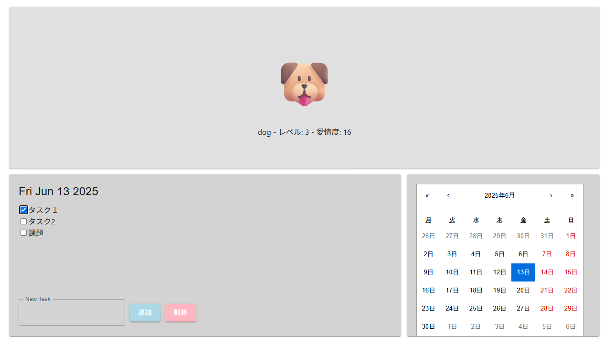

# TodoPet - ゲーミフィケーションタスク管理アプリ

日々のタスク管理に、ペット育成の要素を加えてモチベーションを維持しやすくするWebアプリケーションです。タスクを完了することでペットの「愛情度」が上がり、ユーザーの継続的な利用を促します。




## ✨ コンセプト (Concept)

多くの人にとって、日々のタスク管理は時に退屈で、続けるのが難しいものです。このアプリケーションは、タスクを完了するごとにバーチャルペットが成長するという「ゲーミフィケーション」の要素を取り入れることで、日々のタスク達成に小さな「ご褒美」と「楽しさ」を加え、モチベーションを維持することを目的としています。

## 🚀 主な機能 (Features)

-   タスクの追加・削除機能
-   タスクの完了・未完了を切り替えるチェックリスト機能
-   タスク完了と連動したペットの育成システム（愛情度が上がるとレベルアップ）
-   カレンダーによる日付管理機能

## 🛠️ 使用技術 (Tech Stack)

このプロジェクトは、フロントエンドとバックエンドを分離した構成で開発されています。

-   **フロントエンド:** React, JavaScript, HTML, CSS
-   **バックエンド:** FastAPI, Python
-   **データベース:** SQLite (開発初期段階)
-   **サーバー:** Uvicorn

## 📦 環境構築と実行手順 (Setup and How to Run)

このアプリケーションをローカル環境で実行するための手順です。

### 1. 前提条件

-   Git
-   Node.js (v16以上推奨) と npm
-   Python (v3.8以上推奨)

### 2. インストール

まず、リポジトリをクローンし、フロントエンドとバックエンドそれぞれの依存関係をインストールします。

```bash
# 1. リポジトリをクローン
git clone [あなたのリポジトリのURL]
cd [クローンしたリポジトリ名]

# 2. バックエンドのセットアップ
cd backend
python -m venv myenv
source myenv/bin/activate  # Mac/Linuxの場合
# myenv\Scripts\activate   # Windowsの場合
pip install -r requirements.txt

# 3. フロントエンドのセットアップ
cd ../todopet
npm install
